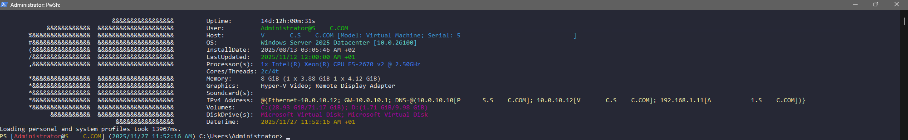
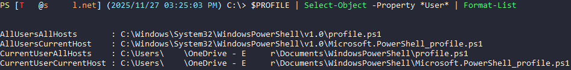

# DotFiles
Scadic's DotFiles

## ToC
1. [Introduction](#1-introduction)  
2. [Bash](#2-bash)  
3. [PowerShell](#3-powershell)  
3.1. [PowerShell Shortcut](#31-powershell-shortcut)  
3.2. [PowerShell Profile](#32-powershell-profile)
3.3. [Company Specific profiles](#33-company-specific-profiles)
3.3.1 [ION](#331-ion)
3.3.2 [HVI](#332-hvi)
3.3.3 [EQNR](#333-eqnr)
4. [Windows Terminal](#4-windows-terminal)

## 1. Introduction
This is where I keep my DotFiles and Terminal configs.  
I primarily (__only__) work with Windows OSes so I will have mostly Windows/PowerShell related things here, but that might change.  


## 2. Bash
This is the standard [`.bashrc`](Bash/.bashrc) file where I only changed the `PS1` variable to get a prompt similar to what I have in PowerShell. So honestly not much here.

## 3. PowerShell
A collection of comprehensive PowerShell profiles the base one will be in the [`PowerShell/Profiles`](PowerShell/Profiles/) directory.  
I have done my best to make the profiles compatible with the restricted language mode.


### 3.1 PowerShell Shortcut
Use the shortcut in the [PowerShell/Shortcuts](PowerShell/Shortcuts/) directory.  
It was generated when I setup the [Dracula theme](https://draculatheme.com/powershell) for PowerShell a long time ago. Put it within your `Start Menu` folder and point it to whatever PowerShell executable you want to use with whatever parameters you want.

### 3.2 PowerShell Profile
The profile can live in 4 different locations specified by the `$Profile` variable.  
List out all the different locations with this:  
```powershell
$PROFILE | Select-Object -Property *User* | Format-List
```  
The list will look something like this:
  
By default the profile is located in the `CurrentUserCurrentHost` part of the `$Profile` variable, meaning that `$Profile` is the same as `$Profile.CurrentUserCurrentHost`. Also the directory is not created by default, but that can easily be fixed by running a one-liner.  
```powershell
If(-Not (Test-Path -Path $($Profile | Split-Path -Parent))){New-Item -ItemType Directory -Path "$($Profile | Split-Path -Parent)"}Else{Write-Host -Object "Profile directory exists."}
```  
When this directory is created you are free to add any PowerShell profile script in there, depending on your computer's and shortcut's configuration the profile script will attempt to run.

### 3.3 Company Specific profiles
As time goes on you end up working for a couple of companies, currently i have 2 which is reflected on the two directores under the [Profiles](PowerShell/Profiles/) directory.

#### 3.3.1 ION
Even after leaving ION Racing back in 2020 I still help out with this and I did creat a profile script for this in the [ION](PowerShell/Profiles/ION/) directory.  


#### 3.3.2 HVI
There is only one script form this which was made during a branding push.  


#### 3.3.3 EQNR
I made two profiles for this directory, one with the current logo and one with the old one.  


## 4. Windows Terminal
ToDo